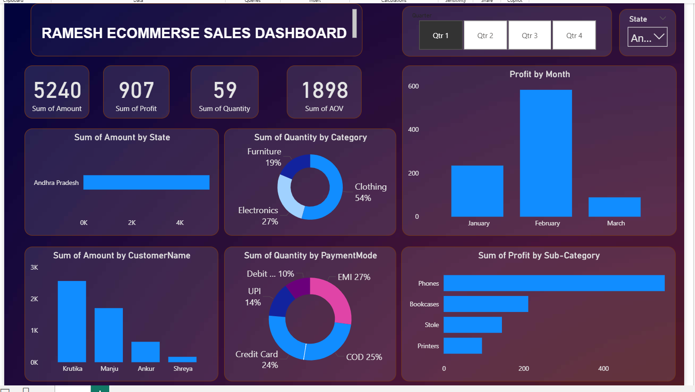

# 📊 RAMESH E-COMMERCE SALES DASHBOARD

## 📌 Project Overview

The **Ramesh E-Commerce Sales Dashboard** is an interactive **Power BI dashboard** designed to analyze e-commerce sales performance and generate meaningful business insights.

The dashboard provides a clear view of key metrics such as **sales, profit, quantity, customers, payment methods, categories, states, and sub-categories**.


## 🎯 Project Objectives

- Analyze overall sales and profit performance
- Identify top-performing customers and states
- Analyze category-wise product demand
- Understand customer payment preferences
- Track monthly profit trends
- Identify profitable sub-categories
- Support data-driven business decisions

---

## 📊 Key Performance Indicators

| KPI | Value |
|---|---:|
| 💰 Total Sales | 17K |
| 📈 Total Profit | 2,695 |
| 📦 Total Quantity | 224 |
| 🛒 Average Order Value | 5,186 |

---

## 📈 Dashboard Features

The dashboard includes the following interactive visualizations:

- **Sales by State**
- **Quantity by Category**
- **Profit by Month**
- **Sales by Customer**
- **Quantity by Payment Mode**
- **Profit by Sub-Category**
- **Quarter Filter**
- **State Filter**

---

## 🖼️ Dashboard Preview

## Dashboard Preview

<p align="center">
  
</p>

---

## 🔍 Key Insights

- **Clothing** contributes the highest share of quantity.
- **COD** is the most frequently used payment method.
- **Bookcases** generate the highest profit among the displayed sub-categories.
- Customer-level analysis helps identify high-value customers.
- Monthly profit analysis helps understand sales performance trends.

---

## 🛠️ Tools & Technologies

- **Power BI**
- **Power Query**
- **DAX**
- **Data Cleaning**
- **Data Transformation**
- **Data Modeling**
- **Data Visualization**

---

## 📂 Project Structure

```text
RAMESH-ECOMMERCE-SALES-DASHBOARD/
│
├── README.md
├── dash.pbix
└── Dashboard.png
